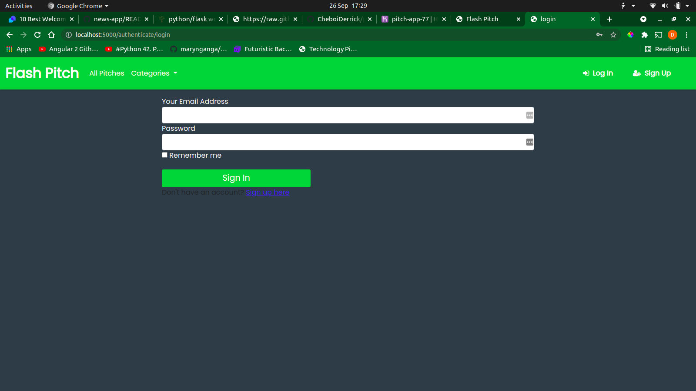
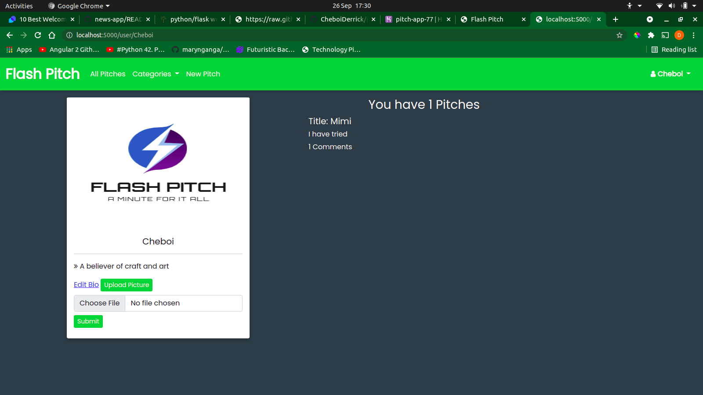

# Flash Pitch

## By [Derrick Cheboi](https://github.com/CheboiDerrick/)

## Description
Flash pitch is a web application that enables the users to submit their one minute pitches and other users will vote on them and leave comments to give their feedback on them.

The pitches are organized by category and users can view their pitches and comments made by other users

## Application Behaviour
These are the behaviours/features that the application implements for use by a user.

A user should be able to:
* See the pitches other people have posted.
* Vote on the pitch they liked and give it a downvote or upvote.
* Sign in for them to leave a comment
* Receive a welcoming email once they sign up.
* View the pitches I have created in their profile page.
* Comment on the different pitches and leave feedback.
* Submit a pitch in any category.
* View the different categories.

## Screenshots
* Home Page

* Pitch Categories

* Sign up

* Login

* User Profile

## SetUp / Installation Requirements
### Prerequisites
* python3.8
* pip3
* pipenv
* Git and Github

### Cloning
* In your terminal:
        
        $ git clone https://github.com/CheboiDerrick/pitch-app.git
        $ cd pitch-app

## Running the Application
* Install the requirements:

         $ pipenv install

* Start your virtual environmrnt;

        $ pipenv shell 

* Export your configuraions

        $ export SQLALCHEMY_DATABASE_URI=postgresql+psycopg2://{User Name}:{password}@localhost/{database name}

        $ export SECRET_KEY='Your secret key'

        $ export MAIL_USERNAME='Your email username'

        $ export MAIL_PASSWORD='Your password'

* To run the application, in your terminal:
        
        $ python3.8 manage.py server
    

* Open your browser and navigate to http://localhost:5000 to view the web app

        
## Technologies and Languages Used
* Python -(3.8)
* Flask

## License
[MIT](https://github.com/CheboiDerrick/pitch-app/blob/main/LICENCE) 

&copy;2021